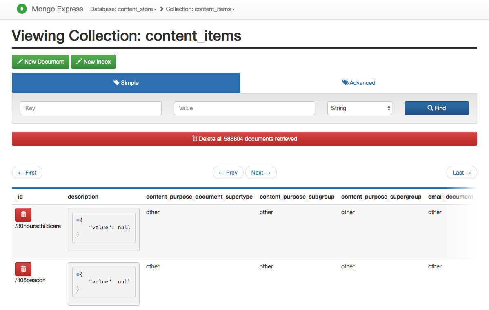

# govuk-mongodb-content
Use Docker to run a local MongoDB instance containing GOV.UK content store and inspect with Mongo Express.

## Get Docker
Download and install Docker. If unfamiliar check out their [tutorials](https://docs.docker.com/get-started/) before proceeding.  

Check your Docker works by running the following code in your terminal:  

```
docker run hello-world
```

Get help with docker with:  

```
docker help
```

## Docker and MongoDB

### Get the Image and run the container

The first time you run the following code the Image will need to be downloaded

```
docker pull mongo
```

Then go make a cup of tea whilst waiting for docker to run the image.

```
docker run --name govuk -d -v /tmp/mongodb:/data/db -p 27017:27017 mongo
```

Where the arguments are:  

```
--name: Name of the container.  
-d: Will start the container as a background (daemon) process. Don’t specify this argument to run the container as foreground process.  
-v: Attach the /tmp/mongodb volume of the host system to /data/db volume of the container.  Note to non-MacOS users, `/tmp` might be RAM rather than disk, so use a different path instead (unless you have copious amounts of RAM).  The path can be whatever you like.
-p: Map the host port to the container port.
hello-mongo: Last argument is the name/id of the image. The version can be specified for reproducibility with a colon.    
```

If you already have previously run a mongodb image also called `govuk` then you will need to drop it first.

```
docker rm -f govuk
```

Use `docker ps` to check what containers are running.  

You can [stop or kill](https://medium.com/@nagarwal/lifecycle-of-docker-container-d2da9f85959) the container at any time - you can restart it with `docker start govuk`.

### Prepare data
Get the content store database dump from a fellow GOV.UK data scientist or developer. Move your data dump of the content store, something like, `content_items.bson` into `/tmp/mongodb` (or wherever you chose in the previous `docker run` command).

Your data should be in a directory that your container can now access.  

### Check for data
Open a bash shell in your recently spun-up govuk container with:

```
docker exec -it govuk bash
```

Check that you can see `content_items.bson` in the correct directory (i.e. the container can access your local volume specified above and the files therein). You can do so via the normal command lines operations such as `ls ...`

### Restore MongoDB from .bson

From the bash shell of the container run:

```
mongorestore -d content_store -c content_items data/db/content_items.bson
```

This should start restoring the `content_items` collection in the `content_store` database on the MongoDB instance.  

If you already have previously restored a mongodb then you will need to drop it first, otherwise it won't get replaced with your newer version.

```
mongorestore --drop -d content_store -c content_items data/db/content_items.bson
```

We can access the MongoDB instance from the container with:

```
mongo 27017
```
Type help for help in the mongo shell.

Run some of these commands to test the database is there.  

### Using toy data instead

If you just want to test this out on some toy data you can copy and paste from [here](https://docs.mongodb.com/manual/reference/bios-example-collection/) and run in the mongo shell to create a collection to practice on.

### Interact with MongoDB instance

Open a new terminal so we can link to it from another container. We download and build a new container from the image `mongo-express` which provides a user interface for managing your MongoDB databases.  

```
docker run --link govuk:mongo -p 8081:8081 mongo-express
```

In your browser, you can look at it for sense check by:

```
http://0.0.0.0:8081/
```

It should look something like this:



### Leveraging the MongoDB with pymongo
We can connect to and make use of this data for metadata extraction and other uses. In these [notebooks](https://github.com/alphagov/govuk-network-embedding/tree/master/notebooks/db) we extract the structural network, or those pages that have embedded links on each page.  

In this repo, we provide a notebook that demonstrates how to connect to and extract the text from each piece of content for use in NLP applications.
